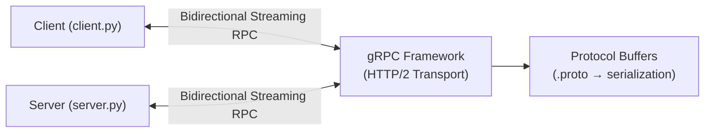

## 1. Титульный лист
**Лабораторная работа №1**  -  Реализация RPC-сервиса с использованием
gRPC   
**Вариант:** 6 (Аналитика)   

---

## 2. Цель работы
- Освоить принципы удалённого вызова процедур (RPC) и их применение в распределённых системах.  
- Изучить основы фреймворка gRPC и языка определения интерфейсов Protocol Buffers (Protobuf).  
- Научиться определять сервисы и сообщения с помощью Protobuf.  
- Реализовать клиент-серверное приложение на Python с использованием gRPC.  
- Получить практические навыки генерации кода, реализации серверной логики и клиентских вызовов для **Server Streaming RPC**.

---

## 3. Номер и описание варианта задания
**Вариант:** 6 — Аналитика  

**Сервис:** AnalyticsService  

**Метод:** StreamEvents(DateRange) — получение потока событий (клики, просмотры) за период  

**Тип RPC:** Server Streaming RPC  

**Описание:**  
Клиент отправляет диапазон дат, сервер возвращает поток сообщений с событиями.  

---
## 4. Настройка окружения 


## 5. Листинг `.proto` файла с комментариями

### Файл `name.proto`
```python
// Используем синтаксис proto3
syntax = "proto3";

// Определяем пакет для сервиса
package analytics;

// Описание сервиса AnalyticsService
service AnalyticsService {
  // Метод StreamEvents — Server Streaming RPC
  // Клиент отправляет DateRange, сервер возвращает поток EventResponse
  rpc StreamEvents (DateRange) returns (stream EventResponse) {}
}

// Сообщение-запрос, передающее диапазон дат
message DateRange {
  string start_date = 1; // Начальная дата периода
  string end_date = 2;   // Конечная дата периода
}

// Сообщение-ответ с информацией о событии
message EventResponse {
  string event_type = 1; // Тип события: "click" или "view"
  string user_id = 2;    // ID пользователя, совершившего действие
  string page = 3;       // Страница, где произошло событие
  string timestamp = 4;  // Время события (строка с датой и временем)
}
```
---

## 6. Листинг серверной части (`server.py`) с комментариями
```python
# Импортируем библиотеку gRPC
import grpc
# futures используется для многопоточности в сервере
from concurrent import futures
import time
# Импортируем сгенерированные файлы из .proto
import name_pb2
import name_pb2_grpc
from datetime import datetime

# Класс сервиса, наследуемся от сгенерированного класса
class AnalyticsService(name_pb2_grpc.AnalyticsServiceServicer):

    # Реализация метода Server Streaming RPC
    def StreamEvents(self, request, context):

        # Печатаем в консоль диапазон дат, полученный от клиента
        print("Запрос за период:", request.start_date, "-", request.end_date)

        # Пример данных событий, которые сервер будет отправлять клиенту
        events = [
            ("click", "user1", "/home"),
            ("view", "user2", "/products"),
            ("click", "user3", "/cart"),
            ("view", "user4", "/checkout"),
        ]

        # Для каждого события создаем и отправляем ответ клиенту
        for event_type, user_id, page in events:
            yield name_pb2.EventResponse(
                event_type=event_type,        # Тип события
                user_id=user_id,              # ID пользователя
                page=page,                    # Страница
                timestamp=str(datetime.now()) # Текущее время
            )
            # Пауза, чтобы показать потоковую передачу
            time.sleep(1)

# Функция запуска сервера
def serve():
    # Создаем сервер с пулом потоков
    server = grpc.server(futures.ThreadPoolExecutor(max_workers=10))
    # Регистрируем сервис на сервере
    name_pb2_grpc.add_AnalyticsServiceServicer_to_server(
        AnalyticsService(), server
    )

    # Открываем порт 50051 для подключения клиентов
    server.add_insecure_port('[::]:50051')
    server.start()  # Запускаем сервер
    print("Сервер запущен на порту 50051")
    server.wait_for_termination()  # Держим сервер активным

# Точка входа при запуске скрипта
if __name__ == '__main__':
    serve()
```
---

## 7. Листинг клиентской части (`client.py`) с комментариями

```python
# Импортируем библиотеку gRPC
import grpc
# Импортируем сгенерированные файлы из .proto
import name_pb2
import name_pb2_grpc

def run():
    # Создаем канал для соединения с сервером на localhost:50051
    channel = grpc.insecure_channel('localhost:50051')
    # Создаем "заглушку" сервиса для вызова методов
    stub = name_pb2_grpc.AnalyticsServiceStub(channel)

    # Формируем запрос с диапазоном дат
    request = name_pb2.DateRange(
        start_date="2025-01-01",
        end_date="2025-01-31"
    )

    # Вызываем метод StreamEvents (Server Streaming RPC)
    responses = stub.StreamEvents(request)

    # Проходим по каждому сообщению потока и выводим на экран
    for response in responses:
        print("Событие:")
        print("Тип:", response.event_type)
        print("Пользователь:", response.user_id)
        print("Страница:", response.page)
        print("Время:", response.timestamp)
        print("----------------------")

# Точка входа при запуске скрипта
if __name__ == '__main__':
    run()
```
---


## Архитектура системы


---
## 8. Скриншоты работы программы

 **Скрин терминала сервиса:**
 


 **Скрин терминала клиента:**


---

## 9. Выводы

* Создан файл `name.proto`, описывающий сервис AnalyticsService и сообщения DateRange и EventResponse. Реализован сервер с методом Server Streaming RPC, который отправляет поток событий клиенту. Реализован клиент, который получает и выводит поток событий. Получены практические навыки работы с gRPC, Protobuf и организации клиент-серверного взаимодействия.

```
