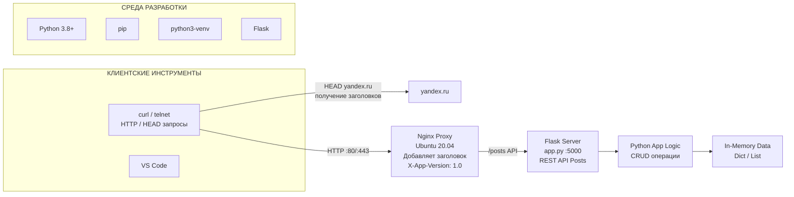

---

# Лабораторная работа №2

## Проектирование и реализация клиент-серверной системы. HTTP, веб-серверы и RESTful веб-сервисы

---

# 1. Титульный лист

* **Студент:** *Губанова Светлана Алексеевна*
* **Группа:** *ЦИБ-241*
---

# 2. Цель работы

Изучить методы отправки и анализа HTTP-запросов с использованием инструментов **telnet** и **curl**, освоить базовую настройку и анализ работы HTTP-сервера **nginx** в качестве веб-сервера и обратного прокси, а также изучить и применить на практике концепции архитектурного стиля **REST** для создания веб-сервисов (API) на языке **Python**.

---
# 3. Краткие теоретические сведения

## HTTP (HyperText Transfer Protocol)

HTTP — это протокол прикладного уровня для передачи данных между клиентом и сервером.

HTTP-запрос содержит:

* метод (GET, POST, PUT, DELETE)
* URI (адрес ресурса)
* заголовки
* тело запроса (необязательно)

HTTP-ответ содержит:

* код состояния (200 OK, 404 Not Found, 302 Redirect)
* заголовки
* тело ответа (HTML, JSON и др.)

---

## Telnet и Curl

### Telnet

Позволяет подключаться к серверу на определенный порт и отправлять HTTP-запросы вручную.

### Curl

Инструмент командной строки для отправки HTTP-запросов.

Позволяет:

* отправлять GET и POST
* передавать JSON
* смотреть заголовки ответа
* тестировать API

---

## Nginx

**Nginx** — высокопроизводительный веб-сервер.

Он может работать как:

### Веб-сервер

Отдает статические файлы:

* HTML
* CSS
* изображения

### Reverse Proxy

Принимает запрос от клиента и перенаправляет его на другой сервер (например Flask).

Это позволяет:

* скрыть внутреннюю архитектуру
* распределять нагрузку
* добавлять HTTP-заголовки

---

## REST и REST API

REST — архитектурный стиль для разработки веб-сервисов.

Основные принципы:

* клиент-серверная архитектура
* отсутствие состояния (stateless)
* использование стандартных HTTP методов

### HTTP методы

* **GET** — получение ресурса
* **POST** — создание ресурса
* **PUT / PATCH** — обновление
* **DELETE** — удаление

---

# 4. Задания 
* Отправка HEAD запроса к yandex.ru для получения только заголовков.
* API для "Посты в блоге" (сущность: id, title, author, text).
* Добавить в ответы от Nginx кастомный заголовок XApp-Version: 1.0.
---
# 4.1  Архитектура решения

# 5. Ход выполнения работы

---

# 5.1 HTTP анализ

Создание рабочей директории

```bash
mkdir blog_api_lab
cd blog_api_lab
```

Отправка HEAD запроса:

```bash
curl -I https://yandex.ru
```

Ответ сервера:

```http
HTTP/2 302
x-content-type-options: nosniff
portal: Home
date: Tue, 17 Mar 2026 09:15:08 GMT
location: https://dzen.ru/?yredirect=true
```

### Анализ

* использовался **HEAD запрос**
* сервер вернул **код 302**
* [ссылка](http://127.0.0.1:5000/api/posts)

---

# 5.2 Создание REST API

Создание проекта

```bash
mkdir blog_api
cd blog_api
```

Создание виртуального окружения

```bash
python3 -m venv venv
```

Активация

```bash
source venv/bin/activate
```

Установка Flask

```bash
pip install flask
```

Результат установки:

```
Successfully installed flask
```

---

## Код REST API (app.py)

```python
from flask import Flask, jsonify, request

app = Flask(__name__)

posts = [
 {"id":1,"title":"First post","author":"Ivan","text":"Hello blog"}
]

next_id = 2


@app.route('/api/posts', methods=['GET'])
def get_posts():
 return jsonify(posts)


@app.route('/api/posts', methods=['POST'])
def create_post():
 global next_id

 data = request.json

 new_post = {
  "id": next_id,
  "title": data.get("title"),
  "author": data.get("author"),
  "text": data.get("text")
 }

 posts.append(new_post)
 next_id += 1

 return jsonify(new_post), 201


if __name__ == "__main__":
 app.run(host="127.0.0.1", port=5000)
```

---

# 5.3 Запуск Flask сервера

Команда:

```bash
python3 app.py
```

Вывод:

```
* Running on http://127.0.0.1:5000
```

Логи запросов:

```
GET /api/posts HTTP/1.1 200
POST /api/posts HTTP/1.1 201
GET /api/posts HTTP/1.0 200
POST /api/posts HTTP/1.0 201
```

Это показывает, что сервер успешно обрабатывает запросы.

---

# 5.4 Настройка Nginx

Открытие конфигурации:

```bash
sudo nano /etc/nginx/sites-available/default
```

Конфигурация:

```nginx
location /api/ {

 proxy_pass http://127.0.0.1:5000;

 proxy_set_header Host $host;
 proxy_set_header X-Real-IP $remote_addr;

 proxy_set_header X-Forwarded-For $proxy_add_x_forwarded_for;
 proxy_set_header X-Forwarded-Proto $scheme;

 add_header X-App-Version "1.0";

}
```

Проверка конфигурации:

```bash
sudo nginx -t
```

Результат:

```
nginx: configuration file syntax is ok
nginx: configuration file test is successful
```

Перезапуск сервера:

```bash
sudo systemctl restart nginx
```

---

# 5.5 Тестирование API через Nginx

## GET запрос

```bash
curl -i http://localhost/api/posts
```

Ответ:

```http
HTTP/1.1 200 OK
Server: nginx/1.18.0 (Ubuntu)
X-App-Version: 1.0
```

JSON данные:

```json
[
 {"author":"Ivan","id":1,"text":"Hello blog","title":"First post"}
]
```

---

## POST запрос

```bash
curl -X POST -H "Content-Type: application/json" \
-d '{"title":"Second post","author":"Anna","text":"Hello from Nginx"}' \
http://localhost/api/posts
```

Ответ:

```json
{"author":"Anna","id":2,"text":"Hello from Nginx","title":"Second post"}
```

---

## Проверка после POST

```bash
curl -i http://localhost/api/posts
```

Ответ:

```json
[
 {"author":"Ivan","id":1,"text":"Hello blog","title":"First post"},
 {"author":"Anna","id":2,"text":"Hello from Nginx","title":"Second post"},
 {"author":"Student","id":3,"text":"Hello demo","title":"Demo post"},
 {"author":"Student","id":4,"text":"Hello demo","title":"Demo post"}
]
```

---

# 6. Выводы

В ходе лабораторной работы были изучены: протокол **HTTP**, отправка запросов через **curl**, настройка веб-сервера **Nginx**, работа **reverse proxy**, разработка **REST API на Flask**.Был разработан серверный API для управления постами блога.

