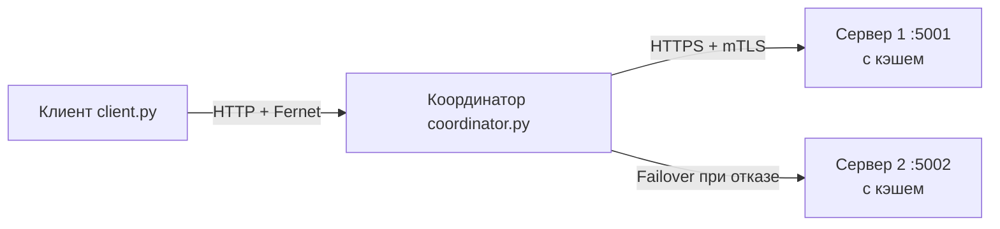

# Лабораторная работа №4 Реализация механизмов безопасности в распределенной системе
## Выполнила

* **ФИО:** Губанова Светлана
* **Группа:** ЦИБ-241
* **Вариант:** 6

---


# Цель работы

Разработать распределенную систему, обеспечивающую защищенную передачу данных с использованием взаимной аутентификации (mTLS) и симметричного шифрования, а также продемонстрировать механизмы отказоустойчивости (failover) через автоматическое переключение между узлами.

---

# Индивидуальное задание

## Вариант 6 — Кэширование

Добавить кэширование для `get_data()` на сервере. Клиент должен проверять наличие актуального кэша.

**Реализовано:**

* Сервер хранит результаты обработки запросов в словаре `cache`.
* При повторном идентичном запросе сервер возвращает сохранённый ответ (без повторной обработки).
* Время жизни кэша (TTL) – 30 секунд.
* Клиент получает флаг `cached`, по которому определяет, был ли ответ взят из кэша (`📦 ИЗ КЭША`) или вычислен заново (`✨ НОВЫЙ`).
* В консоли сервера отображаются события `[КЭШ MISS]` и `[КЭШ HIT]`.

---

# Используемые технологии

* Python 3.8+
* Flask
* requests
* cryptography
* OpenSSL

---

# Архитектура системы



---

# Структура проекта


---

# Настройка окружения

## 1. Создание виртуального окружения

```bash
python3 -m venv venv
source venv/bin/activate
```

## 2. Установка зависимостей

```bash
pip install flask cryptography requests
```

---

# Генерация сертификатов (PKI)

```bash
chmod +x generate_certificates.sh
./generate_certificates.sh
```

Будут созданы:

* сертификат центра сертификации (CA)
* сертификат сервера
* сертификат клиента

---

# Генерация ключа Fernet

```bash
python3 generate_key.py
```

Будет создан файл `encryption_key.txt`.

---

# Исходные коды

## Сервер (`server.py`) – с реализацией кэширования

```python
from flask import Flask, request, jsonify
import ssl
import sys
import time
from cryptography.fernet import Fernet

app = Flask(__name__)

# ========== КЭШИРОВАНИЕ ==========
cache = {}           # ключ – текст запроса, значение – (ответ, время сохранения)
CACHE_TTL = 30       # время жизни кэша в секундах
# =================================

# Загрузка ключа шифрования
with open("encryption_key.txt", "rb") as f:
    key = f.read()
cipher = Fernet(key)

@app.route("/api/data", methods=["POST"])
def get_data():
    try:
        data = request.json
        encrypted_message = data["data"]

        # Расшифровка сообщения
        decrypted_message = cipher.decrypt(encrypted_message.encode()).decode()

        # ---------- ПРОВЕРКА КЭША ----------
        current_time = time.time()
        if decrypted_message in cache:
            cached_response, cached_time = cache[decrypted_message]
            if current_time - cached_time < CACHE_TTL:
                print(f"[КЭШ HIT] {decrypted_message}")
                # Отдаём зашифрованный ответ из кэша
                encrypted_response = cipher.encrypt(cached_response.encode()).decode()
                return jsonify({
                    "status": "success",
                    "response": encrypted_response,
                    "cached": True
                })
            else:
                # Кэш устарел – удаляем
                del cache[decrypted_message]
        # -----------------------------------

        # Если кэша нет или он устарел – обрабатываем запрос
        print(f"[КЭШ MISS] {decrypted_message}")
        port = sys.argv[1] if len(sys.argv) > 1 else "5000"
        response_text = f"Обработано: '{decrypted_message}' (сервер {port})"

        # Сохраняем в кэш
        cache[decrypted_message] = (response_text, current_time)

        # Шифруем ответ
        encrypted_response = cipher.encrypt(response_text.encode()).decode()

        return jsonify({
            "status": "success",
            "response": encrypted_response,
            "cached": False
        })

    except Exception as e:
        return jsonify({"status": "error", "message": str(e)}), 500

if __name__ == "__main__":
    port = int(sys.argv[1]) if len(sys.argv) > 1 else 5001

    # mTLS настройка
    context = ssl.SSLContext(ssl.PROTOCOL_TLS_SERVER)
    context.load_cert_chain("server_cert.pem", "server_key.pem")
    context.load_verify_locations("ca_cert.pem")
    context.verify_mode = ssl.CERT_REQUIRED

    print(f"=== Сервер с КЭШИРОВАНИЕМ на порту {port} ===")
    print(f"TTL кэша: {CACHE_TTL} секунд")
    app.run(host="0.0.0.0", port=port, ssl_context=context)
```

## Клиент (`client.py`) – проверяет актуальность кэша

```python
import requests
from cryptography.fernet import Fernet

# Загрузка ключа
with open("encryption_key.txt", "rb") as f:
    key = f.read()
cipher = Fernet(key)

def send_message(message):
    encrypted_message = cipher.encrypt(message.encode()).decode()
    with open("client_cert.pem", "r") as f:
        client_cert = f.read()

    payload = {
        "certificate": client_cert,
        "data": encrypted_message
    }

    response = requests.post("http://localhost:8000/api/data", json=payload, timeout=10)
    data = response.json()

    if data["status"] == "success":
        encrypted_response = data["response"].encode()
        decrypted_response = cipher.decrypt(encrypted_response).decode()
        cached_status = "📦 ИЗ КЭША" if data.get("cached") else "✨ НОВЫЙ"
        print(f"[{cached_status}] {decrypted_response}")
    else:
        print(f"❌ Ошибка: {data.get('message')}")

if __name__ == "__main__":
    print("\n=== ТЕСТИРОВАНИЕ КЭШИРОВАНИЯ ===\n")
    send_message("Привет")
    send_message("Привет")
    send_message("Как дела")
    send_message("Привет")
```

## Координатор (`coordinator.py`) – балансировка + failover

```python
from flask import Flask, request, jsonify
import requests
import urllib3

urllib3.disable_warnings()
app = Flask(__name__)

SERVERS = [
    "https://127.0.0.1:5001/api/data",
    "https://127.0.0.1:5002/api/data"
]
CERT = ("client_cert.pem", "client_key.pem")

@app.route("/api/data", methods=["POST"])
def forward():
    data = request.json
    for server in SERVERS:
        try:
            resp = requests.post(server, json=data, cert=CERT, verify=False, timeout=5)
            if resp.status_code == 200:
                return jsonify(resp.json())
        except Exception as e:
            print(f"Сервер недоступен: {server} - {e}")
    return jsonify({"status": "error", "message": "Все серверы недоступны"}), 503

if __name__ == "__main__":
    print("=== КООРДИНАТОР ЗАПУЩЕН ===")
    app.run(host="0.0.0.0", port=8000)
```

---

# Запуск системы

## Терминал 1 — Сервер 1 (с кэшем)

```bash
python3 server.py 5001
```

## Терминал 2 — Сервер 2 (с кэшем)

```bash
python3 server.py 5002
```

## Терминал 3 — Координатор

```bash
python3 coordinator.py
```

## Терминал 4 — Клиент

```bash
python3 client.py
```

---

# Реализованный функционал

## HTTPS

Передача данных между координатором и серверами выполняется по HTTPS.

## mTLS

Используются клиентские и серверные сертификаты X.509 – взаимная аутентификация.

## Fernet-шифрование

Полезная нагрузка дополнительно шифруется алгоритмом Fernet (сообщение клиента и ответ сервера).

## Failover

Координатор автоматически перенаправляет запросы на резервный сервер при отказе основного.

---

# Демонстрация работы

## 1. Демонстрация работы кэша (одинаковые запросы)

**Запуск клиента** – три одинаковых сообщения "Привет".

**Результат на клиенте:**


**Результат на сервере 5001:**


**Вывод:** Повторные запросы обслуживаются из кэша – кэширование работает.

---

## 2. Демонстрация отказоустойчивости (Failover)

1. Запущены оба сервера и координатор.
2. Клиент отправляет запрос – отвечает сервер 5001.
3. Сервер 5001 остановлен (Ctrl+C).
4. Клиент повторяет запрос.

**Результат:** координатор автоматически перенаправляет запрос на сервер 5002.

```
[✨ НОВЫЙ] Обработано: 'Привет' (сервер 5002)
```

Лог координатора:

```
Сервер недоступен: https://127.0.0.1:5001/api/data
Сервер 5002 отвечает успешно.
```


**Вывод:** Система устойчива к отказу одного из серверов.

---


# Принцип работы системы с кэшированием

1. Клиент вводит сообщение (например, "Привет").
2. Сообщение шифруется алгоритмом Fernet.
3. Клиент отправляет зашифрованный запрос координатору (HTTP, порт 8000).
4. Координатор перенаправляет запрос на один из серверов (по round‑robin, с отказоустойчивостью).
5. Сервер расшифровывает сообщение.
6. **Проверка кэша:**
   - Если запрос уже есть в кэше и он не устарел (TTL), сервер возвращает сохранённый ответ, не выполняя обработку.
   - Если запроса в кэше нет или он устарел, сервер выполняет бизнес-логику, формирует ответ, сохраняет его в кэш с текущим временем.
7. Сервер шифрует ответ и отправляет его обратно через координатор клиенту.
8. Клиент расшифровывает ответ и выводит сообщение с указанием, был ли ответ из кэша (`📦 ИЗ КЭША`) или вычислен заново (`✨ НОВЫЙ`).
9. При недоступности основного сервера координатор автоматически переключается на резервный сервер.

---

# Вывод

Разработана распределенная система, обеспечивающая защищенную передачу данных с использованием взаимной аутентификации (mTLS) и симметричного шифрования, а также продемонстрированы механизмы отказоустойчивости (failover) через автоматическое переключение между узлами.
